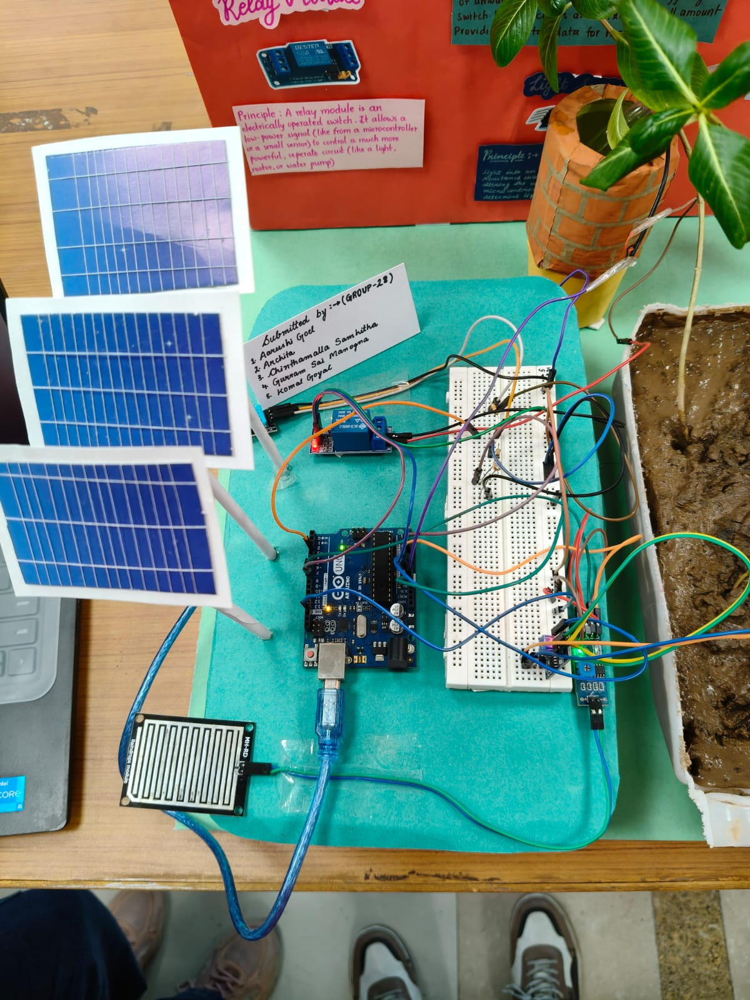
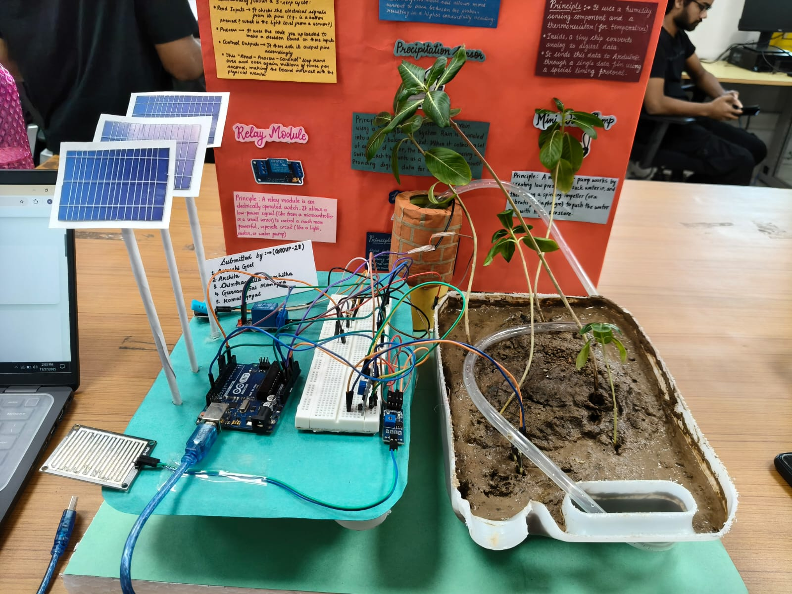
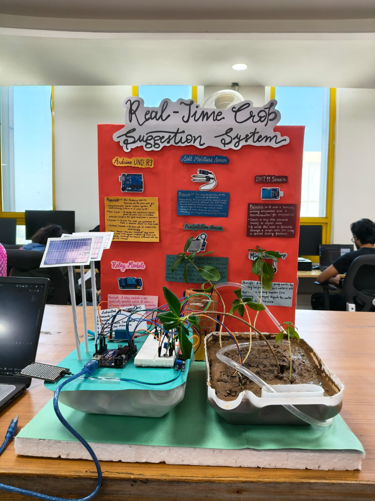

# 🌱 Crop Suggestion System

An **IoT-based Smart Crop Suggestion and Soil Monitoring System** that collects real-time environmental data from sensors and assists farmers in selecting suitable crops while monitoring field conditions efficiently.

---

## 📌 Project Overview

This project integrates **IoT sensors, cloud storage, and a web dashboard** to monitor soil and environmental parameters in real time. Based on the collected data, the system recommends suitable crops and helps farmers make informed irrigation decisions.

The objective is to improve agricultural productivity, reduce water wastage, and promote data-driven farming practices.

---

## 👨‍💻 Group Members

| Name | Entry Number |
|------|------|
| Archita | 2024mcb1288 |
| Komal Goyal | 2024mcb1298 |
| Aarushi Goel | 2024mcb1283 |

---
## 📷 Project Images

  
  
  

---

## 🚀 Features

- 📡 Real-time sensor data collection
- 🌡 Temperature and humidity monitoring
- 💧 Soil moisture monitoring
- 🌧 Rainfall detection
- ☀ Light intensity measurement
- 🌱 Crop recommendation system
- 📊 Interactive web dashboard
- ☁ Firebase cloud integration
- 🌦 Weather forecast using OpenWeatherMap API
- 🚨 Irrigation alerts and monitoring

---

## ⚙ System Architecture

1. Sensors collect real-time environmental data.
2. Arduino processes the sensor readings.
3. Data is uploaded to Firebase Realtime Database.
4. Web dashboard fetches live data.
5. Rule-based logic suggests suitable crops and irrigation actions.

---

## 🛠 Hardware Components

- Arduino UNO R3
- Soil Moisture Sensor
- DHT11 Sensor
- Rain Sensor
- LDR Sensor
- Relay Module
- Mini Water Pump
- Breadboard
- Jumper Wires

---

## 💻 Technologies Used

| Category | Technologies |
|----------|--------------|
| Hardware | Arduino UNO, IoT Sensors |
| Backend | Firebase Realtime Database |
| Frontend | HTML, CSS, JavaScript |
| API | OpenWeatherMap API |
| IDE | Arduino IDE |

---

## 📖 Working

- Collects live sensor values.
- Stores data on Firebase.
- Displays readings on the web dashboard.
- Analyzes soil and weather conditions.
- Recommends suitable crops.
- Generates irrigation-related alerts.

---

## 📚 Learning Outcomes

- IoT system development
- Sensor integration
- Cloud database connectivity
- Web dashboard development
- Real-time monitoring
- Rule-based crop recommendation

---

## 🔮 Future Scope

- Machine Learning based crop prediction
- Android application
- SMS notification system
- Multi-farm monitoring
- AI-powered recommendation engine

---

## ⭐ Acknowledgement

This project was developed as a group project for academic purposes to explore the practical implementation of IoT in smart agriculture.
